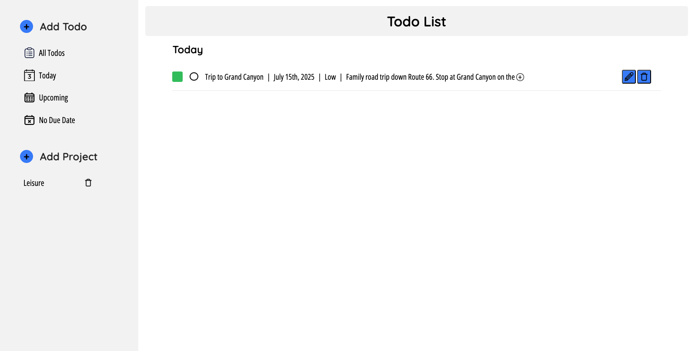
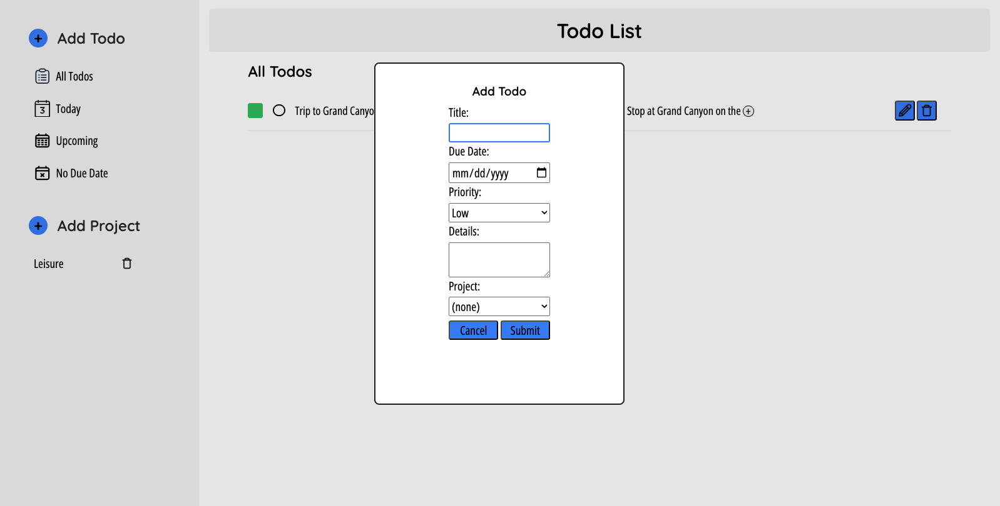
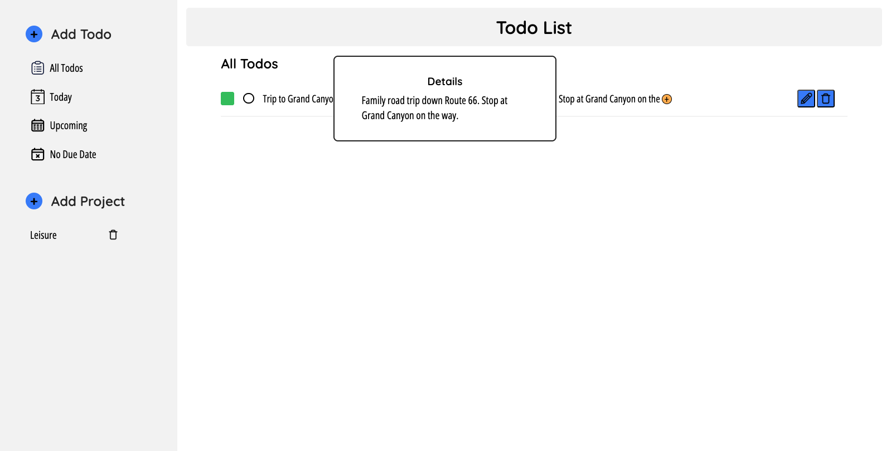

# 📝 Todo List for The Odin Project

## 💻 Tech Stack:

- JavaScript ES6+
- HTML5
- CSS3
- Webpack
- date-fns library
- npm
- localStorage API

---

## ⛲ Key Features:

- Clean, intuitive UI
- Editable todos
- 'Expand' button with dialog for truncated 'details' section
- 'Priority' color blocks coupled with text notation to ensure that user can clearly see todo priorities
- Filters for todos based on specific criteria (today's date, upcoming date, no date, all todos)
- Use of localStorage to recall todos/projects in order upon reloading the page
- Strikethrough line for todos marked "Complete"

---

## 🧞 Future Implementations Wishlist

- Dark/Light mode toggle option
- Project renaming capabilities
- Mobile/Tablet Optimization

---

## 🗣️ Description

This is a todo list productivity application built for The Odin Project curriculum. This Todo List allows users to add new "projects" (lists) and add "todos" (tasks) to those lists.

Since we have been working with ESMs and webpack, the project prompt implored us to continue using webpack as a bundler. I utilized a webpack template that I made previously, to jumpstart this project.

The TOP project prompt also suggested that we make use of the 'date-fns' library. This wound up being extremely useful when formatting ISO 8601 dates to make them more palatable for the UI.

---

## ⛰️ Challenges Faced

There were many challenges faced in this project. Notably, constructing the todos' logic separately from the projects' logic. When a todo is created, it has to search through the master project array and find its project. This is where randomUUIDs came into play, as I attached the project's UUID to the todo upon creation. This came in handy when both creating and deleting todos.

A separate challenge was organizing all of the code into appropriate ESMs. Deciding where to place the logic for project-manager.js, dom.js, etc was a nice challenge and helped organize my project in a readable and maintainable way.

---

## 🖥️ Screenshots

Main UI


Add Todo Modal


'Details' Overflow Dialog w/ Orange Button Hover Effect


---

## 🏃‍♂️‍➡️ Run This Project Locally

#### 1. Clone Repo

```
git clone https://github.com/SamsDevLab/todo-list.git
```

#### 2. CD into project folder

```
cd todo-list
```

#### 3. Install dependencies from package.json

```
npm install
```

#### 4. Start development server:

```
npm run start
```

#### 5. Visit local web server in your browser to view:

```
localhost:8080
```
